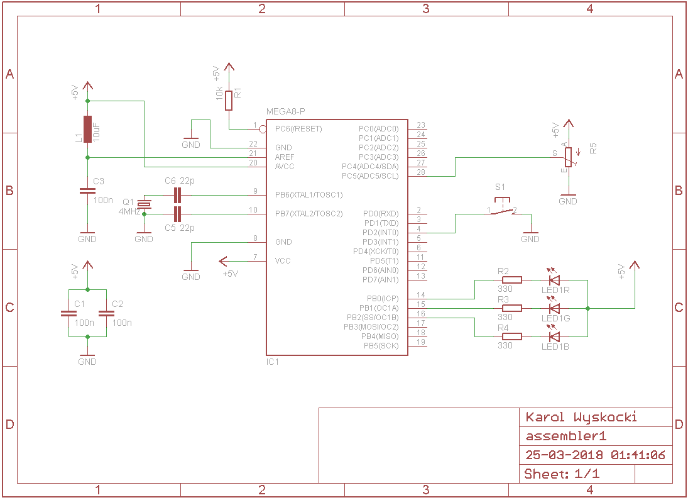

# Projekt 3
W projekcie 3 został wykorzystany przetwornik analogowo-cyfrowy (ADC). Przetwornik mierzy napięcie na wyjściu potencjometru, który działa jak dzielnik napięcia. Gdy napięcie na wyjściu dzielnika jest w zakresie od 0 do 1/3 napięcia zasilania, świeci się zielona dioda. W zakresie 1/3 do 2/3 napięcia zasilania świeci się kolor żółty (dioda czerwona i zielona razem). Powyżej 2/3 napięcia zaislania świeci się kolor czerwony. Kolejne pomiary są startowane w sposób programowy (single conversion). Na wynik pomiaru rownież czekamy w sposób programowy.
## Sprzęt
Program jest napisany na mikrokontroler ATMega8A. Na potrzeby pierwszych kilku projektów został stworzony niewielki układ prototypowy, w skład którego, oprócz wspomnianego mikrokontrolera, wchodzą: przycisk, dioda RGB oraz potencjometr montażowy. Poniżej schemat układu:

